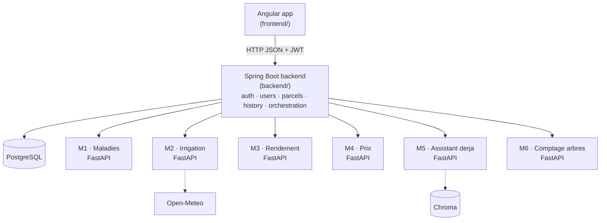

# Zitouna AI 🫒

Assistant intelligent pour les petits oléiculteurs tunisiens : diagnostiquer les maladies des feuilles, irriguer au bon moment, estimer la récolte, choisir quand vendre, poser ses questions en derja.


## Architecture



- **Spring Boot is the core**: authentication (Spring Security + JWT), users, parcels, prediction history, and orchestration (calling the modules and combining their results, e.g. M6 → M3 → M4).
- **FastAPI services are thin**: one per module, ~50–100 lines, they load the trained model and expose `POST /predict`. No business logic, no database.
- The app only talks to the backend. The backend is the only one talking to the AI services.
- Each AI service works in **mock mode** until its model is trained, so everyone can integrate from week 2.

The full contract (every endpoint, every JSON field) is in [docs/api-contract.md](docs/api-contract.md).

## Repository layout

```
.
├── backend/              Spring Boot 4 · Java 21 · PostgreSQL · Flyway
├── frontend/             Angular 21
├── ai-services/          one FastAPI service per module (m1-disease … m6-tree-count)
├── notebooks/            one folder per module: data exploration + training
├── data/                 raw/ and processed/ datasets (NOT in Git, shared on Drive)
├── models/               trained weights mounted into the AI containers (NOT in Git)
├── docs/                 API contract, report material
├── docker-compose.yml    the whole stack
└── .github/              CI, PR / issue templates, CODEOWNERS
```

## Team

| Member | AI module | Cross-cutting role |
|---|---|---|
| Membre 1 | M1 · Leaf diseases (vision, classification) | Image pipeline shared with M6 |
| Membre 2 | M2 · Irrigation & weather alerts (time series) | Backend & API integration |
| Membre 3 | M3 · Yield forecast (tabular regression) | Experiment tracking (MLflow), Git repo |
| Membre 4 | M4 · Price & selling time (time series) | Frontend |
| Membre 5 | M5 · Derja assistant (NLP + RAG) | Report, tests, demo |
| Membre 6 | M6 · Olive tree counting (object detection) | Docker & deployment |

Each member owns their module end to end: data → notebook → model → FastAPI service → screen in the app.

## Quick start (whole stack with Docker)

Prerequisites: Docker Desktop, Git.

```bash
git clone https://github.com/azizdlissiesprit/ZitounAI.git zitouna-ai
cd zitouna-ai
cp .env.example .env          # then put a long random JWT_SECRET in .env
docker compose up --build
```

| What | URL |
|---|---|
| App | http://localhost:4200 |
| Backend Swagger UI | http://localhost:8080/swagger-ui.html |
| AI services Swagger UI | http://localhost:8001/docs … http://localhost:8006/docs |
| PostgreSQL | `localhost:5432`, db `zitouna`, user/password from `.env` |

Ports already used on your machine (e.g. a local PostgreSQL on 5432, Oracle on 8080)? Set `DB_PORT`, `BACKEND_PORT`, `FRONTEND_PORT` in `.env`.

Check the chat end to end (app → backend → M5 → modules): `python scripts/smoke_chat.py http://localhost:8080`

## Local development (one part at a time)

Run only what you don't work on in Docker, and your part from your IDE. Example for the backend owner:

```bash
docker compose up postgres m1-disease m2-irrigation m3-yield m4-price m5-assistant m6-tree-count
```

| Part | Prerequisites | Run | Test |
|---|---|---|---|
| [backend/](backend/) | JDK 21 | `./mvnw spring-boot:run` (`mvnw.cmd` on Windows) | `./mvnw verify` |
| [frontend/](frontend/) | Node 24 | `npm install` then `npm start` → http://localhost:4200 (proxies `/api` to `:8080`) | `npx ng test` |
| [ai-services/mX-…](ai-services/) | Python 3.12 | see the service README | `python -m pytest` |

## Roadmap

10 weeks, 5 phases of 2 weeks, each ending with a 30-minute team review and a merge of `develop` into `main` (tagged release).

| Phase | Weeks | Goal | Tag |
|---|---|---|---|
| 1 · Data | W1–W2 | Datasets downloaded/extracted, API contract frozen, repo + Docker ready | `v0.1.0` |
| 2 · Baselines | W3–W4 | One simple model + metric per module, screens on mock data | `v0.2.0` |
| 3 · Models + APIs | W5–W6 | ≥ 2 approaches compared, best one served by FastAPI, results in MLflow | `v0.3.0` |
| 4 · Integration | W7–W8 | All 6 modules wired, M6 → M3 → M4 chain, internal demo | `v0.4.0` |
| 5 · Finalisation | W9–W10 | User tests, report, slides, backup video | `v1.0.0` |

Track the work in a GitHub Project board (columns *Todo / In progress / In review / Done*), one issue per task.

## Contributing

Read [CONTRIBUTING.md](CONTRIBUTING.md) before your first commit: branches, commit messages, pull requests, data and model files.
